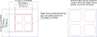
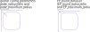
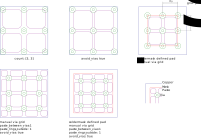

# IPC Footprint Generator for No Lead Packages

This generator uses IPC-7351B equations and fillet definitions to derive a footprint for no-lead style packages from the dimensions of the package. (The suggested footprint is only used to determine the size of the exposed pad.) Fillet size definitions can be changed by pointing to a personalized IPC parameter file. The script generates footprints in zero orientation version A (pin 1 at top left corner).
Pads are generated using rounded rectangle pads as suggested in preliminary releases of IPC-7351C.

Examples of supported packages include: DFN, QFN, SON, LGA.

## Running the Script

The script requires python 3.4 or newer. Run it with:
`python3 ipc_noLead_generator.py size_definitions/dfn.yaml` (replace `dfn.yaml` with the size definition file that contains your part.)

### Optional Script Parameters

* --global_config: the config file defining how the footprint will look like. (KLC) (default=`../../tools/global_config_files/config_KLCv3.0.yaml`)
* --series_config: the config file defining series parameters (footprint naming). (default=`../package_config_KLCv3.yaml`)

* --density: IPC density level (L,N,M) (default=`N`)
* --ipc_doc: IPC definition document (default=`../ipc_definitions.yaml`)

* --force_rectangle_pads: Force the generation of rectangle pads instead of rounded rectangle
* --kicad4_compatible: Create footprints compatible with version 4 (avoids round-rect and custom pads).

## Size Definition Format


The size definition file contains one entry per package size definition. The top level parameter will give the internal parameter set name. This one must be unique in this file and should be representative of the footprint as it will be used in error messages. (It also makes later maintenance easier if it is easy to determine which footprint was generated by which parameter set.)

``` yaml
internal_package_name:
  # parameter list (See below)
```

### Documentation and Naming Parameters
- Size source to be added to footprint documentation field (`size_source`) {url}
- Footprint library name (`library`) {string}
- Footprint name generation control
  - Device type added as prefix. Example QFN. (`device_type`) {string}
  - Selction of different name format. Example for LGA footprints. (`use_name_format`) {enum(`LGA`, `not LGA`)}
  - Manufacturer name. Will be added as a prefix if given. (`manufacturer`) {string}
  - Part number. Will be added as a prefix if given. (`part_number`) {string}
  - Suffix: A custom suffix (added after pin pitch in default naming format). Can include parameters `pad_x` and `pad_y`.
  - Custom naming (`custom_name_format`) {python format string}
    - The full default format string is `{man:s}_{mpn:s}_{pkg:s}-{pincount:d}-1EP_{size_x:g}x{size_y:g}mm_P{pitch:g}mm{suffix:s}_EP{ep_size_x:g}x{ep_size_y:g}mm_Mask{mask_size_x:g}x{mask_size_y:g}mm{suffix2:s}{vias:s}` (The same parameters can be used in your custom format. Exposed pad parameters are not available for components without exposed pad.)

_Note: Contributions intended for the official library shall not include the manufacturer or part number unless the footprint is specific to that manufacturer or part. Similarly avoid custom naming for official library contributions unless required to achieve the requested name (Example TI-specific naming)._

### Package Dimensions

- Body size (`body_size_x`, `body_size_y`, `overall_height`) {dimension}
- Lead dimensions:
  - Lead width (`lead_width`) {dimension}
  - Lead length (`lead_len`) {dimension}
    - Optional for specifying different length for horizontal and vertical leads (`lead_len_H`, `lead_len_V`) {dimension}
- Lead pitch, currently equal for all sides (`pitch`) {float}

#### Pull Back Leads
By default the leads are assumed to extend to the body edge. Some components however have the leads pulled back a bit. A typical example are packages that are called LGA by manufacturers.
These packages need to select the pull back option for the IPC class (`ipc_class: 'qfn_pull_back'`) and need to be able to specify where the lead is.


- Most manufacturers give the lead pull back distance (`lead_to_edge`) {dimension}
   - Alternatively the center position can be given (`lead_center_pos_x` and `lead_center_pos_y`) {dimension}
   - Another alternative is to give the center to center dimenions for leads. (`lead_center_to_center_x` and `lead_center_to_center_y`) {dimension}
- Some manufacturers give the body to inner edge dimension instead of the lead length (`body_to_inside_lead_edge`) {dimenions}

### Pad Count
- Pad count (`num_pins_x`, `num_pins_y`) {int}
  - `num_pins_x`=0 is used for generating DNF like packages.
  - `num_pins_y`=0 is used to generate DNF like package footprints but with inverted pin numbering (Mirrored numbering scheme. Some manufactures use this style in their datasheets. Make sure you are not looking at the bottom view before using this. Not supported for QFN and similar.)

### Exposed pad Handling:

- Size of package exposed pad or slug (`EP_size_x`, `EP_size_y`) {dimension}
- Size of the footprint pad [optional] (`EP_size_x_overwrite`, `EP_size_y_overwrite`) {float}
   - Pad size is equal to nominal package pad size if not given.
   - Use this to create a soldermask-defined pad.
- Optional the size of the mask cutout (`EP_mask_x`, `EP_mask_y`) {float}
   - Use to create soldermask-defined pads (in combination with `EP_size_x_overwrite`)
- Paste is split into a regular grid with (`EP_num_paste_pads`) {[int (x), int (y)]}
  - The optional paste coverage multiplier determines how much of the exposed copper area is covered by paste. (`EP_paste_coverage`) {float (0..1), default=0.65}

### Rounding of Exposed Pad Corners
IPC excludes exposed pads from the requirement for rounding its corners. By default the exposed pad does therefore not use rounded corners. Some datasheets do however suggest the use of rounded corners either specified to a specific value or implicitly shown to be equal to the normal pads.



- Paste corner rounding is controlled by global config parameters `paste_radius_ratio` and
`paste_maximum_radius` {float}
- The round radius of the exposed pad can be directly set with `EP_round_radius` {float/"pad"}
  - The string "pad" can be used to use the same radius for the exposed pad as for the normal pads.
  - Alternatively the round radius ratio and max radius can be set using `EP_round_radius_ratio` and `EP_maximum_radius` {float}
    - Both these can be set per footprint or in the global config file.

### Thermal Vias
A package with exposed pad can generate a version with thermal vias. This will be generated in addition to the normal version.



``` yaml
  thermal_vias:
    # thermal via version parameters
```
- Number of vias generated in the regular grid (`count`) {[int (x), int (y)]}
- Final hole size (`drill`) {float}
- Optional grid (`grid`) {[float (x), float (y)]}
  - Auto generated if not given (outermost pad will touch pad edge).
- Paste coverage overwrite [optional] (`EP_paste_coverage`) {float (0..1)}
  - Thermal via version might need higher paste coverage compared to non-via version to compensate solder lost due to wicking.
- Paste generator can be set up to avoid placing paste on top of vias (`paste_avoid_via`) {bool}
  - Clearance between via hole and paste (`paste_via_clearance`) {float}
  - Can lead to math exceptions. Possible fixes:
     - Reduce paste coverage (make sure you still have enough paste)
     - Play with the via grid and number of paste pads (having an outer ring of paste pads often helps. This is only possible if there is space on the outside)
     - If no fix is satisfactory then select avoid vias as false and increase paste coverage to combat solder loss.
- Number paste pads
  - Quantity of paste pads (`EP_num_paste_pads`) {[int (x), int (y)]}
  - Alternative available if `paste_avoid_via` is true
    - Number of paste pads between 4 vias (`paste_between_vias`) {[int (x), int (y)]}
    - Number of additional paste pad rings outside the outermost vias [optional] (`paste_rings_outside`) {[int (x), int (y)]}


## Dimension Parameter Format
Dimensions in datasheets are either given with minimum and maximum value (optionally including nominal) or with the nominal value plus a tolerance. Some values of the datasheet are given as reference value without tolerance. (Tolerances in this measurement are already included in other dimensions.) The script reflects this by offering the same options.

Always include the nominal dimension if the tolerance is asymmetrical as the resulting footprint will differ if it is not included.

_Note: Contributions that are intended for the official KiCad library must use the same dimensioning format as the datasheet. (If min, nom and max are given then all 3 must be entered into the YAML file even if the tolerance is symmetrical. Similarly use nominal plus tolerance format if the datasheet is dimensioned this way.)_

### String-based

The parameter can be given as a string in one of the following formats (white space characters are ignored).

```yaml
parameter_name: 1.2 # nominal only (reference dimension marked as such in datasheet)
parameter_name: 1.1 .. 1.2 .. 1.3 # min .. nominal .. max
parameter_name: 1.1 .. 1.3 # min .. max
parameter_name: 1.2 +/-0.1 # nominal plus symmetrical tolerance
parameter_name: 1.2 +0.1 -0.05 # nominal plus asymmetrical tolerance
```

### Dict-based

```yaml
parameter_name: # nominal only
  nominal: 1.2
  tolerance: 0 # optional to make it clear that this is the case
parameter_name: # minimum maximum and nominal
  minimum: 1.1
  nominal: 1.2
  maximum: 1.3
parameter_name: # minimum maximum
  minimum: 1.1
  maximum: 1.3
parameter_name: # nominal with symmetrical tolerance
  nominal: 1.2
  tolerance: 0.1
parameter_name: # nominal with asymmetrical tolerance
  nominal: 1.2
  tolerance: [-0.05, 0.1] # order does not matter, the sign is important.
```

### Deprecated format

Support for this format will be dropped in the future. This format only supports min, nom, max dimensioning.

```yaml
parameter_name_min: 1.1
parameter_name: 1.2
parameter_name_max: 1.3
```
